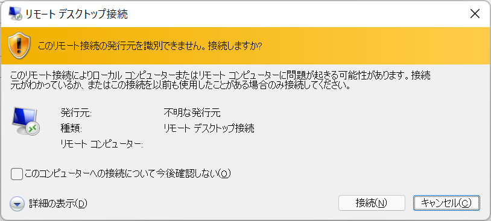
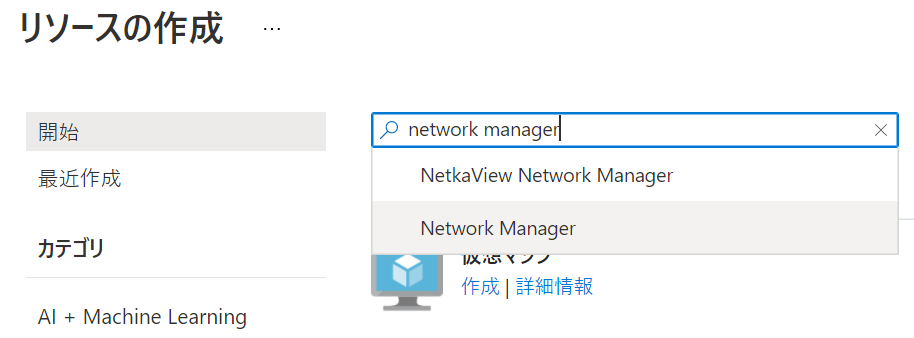
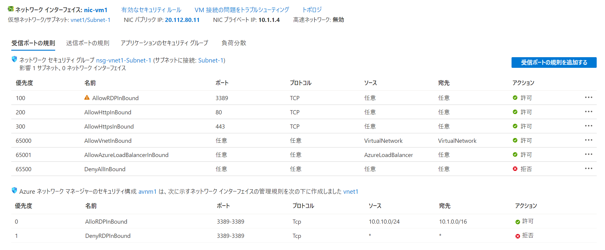

Network Hands-on lab  
December 2021

<br />

**Contents**
- [Exercise 1： セキュアな RDP/SSH 接続の構成](#exercise-1-セキュアな-rdp/ssh-接続の構成)

  - [Task 1： RDP による仮想マシンへの接続](#task-1-rdp-による仮想マシンへの接続)

  - [Task 2： Hub 仮想ネットワークの展開](#task-2-hub-仮想ネットワークの展開)

  - [Task 3： Virtual Network Manager の作成](#task-3-virtual-network-manager-の作成)

  - [Task 4：接続構成とセキュリティ管理規則の作成](#task-4-接続構成とセキュリティ管理規則の作成)

- [Exercise 2](#exercise-2)

<br />

## Exercise 1： セキュアな RDP/SSH 接続の構成

### Task 1： RDP による仮想マシンへの接続

- ブラウザを起動し [Azure Portal](#https://portal.azure.com/) へアクセス

- リソース グループの仮想マシンを選択し、仮想マシンの管理ブレードへ移動

- **接続** メニューを表示

  **RDP** タブを選択し **RDP ファイルのダウロード** をクリック

  

- リモート デスクトップ接続のダイアログで **接続** をクリック

  

- 資格情報を入力

  

- リモート デスクトップ接続のダイアログで **はい** をクリック

  

- RDP でインターネット経由で仮想マシンに接続できることを確認

  

<br />

### Task 2： Hub 仮想ネットワークの展開

- Azure Portal のホーム画面で **リソースの作成** をクリック

- 検索ボックスに **Virtual Network** と入力し、表示された候補から **Virtual Network** を選択

  

- **作成** をクリック

  

- リソース グループを選択し、仮想ネットワークの名前を入力

  

- **IPv4 アドレス範囲** を確認

  

  ※IPv4 アドレス範囲を変更する場合は、サブネットを追加

  

- **セキュリティ** タブで Basition を有効化

  - **BastionHost**: **有効化**

  - **Basiton名**： 任意

    

    ※パブリック IP アドレスを新規作成

    

- 設定内容を確認し作成

<br />

### Task 3： Virtual Network Manager の作成

- サブスクリプション管理ブレードの **プレビュー** を選択

  

- 検索ボックスに **network** と入力

  フィルター処理された結果から **AllowAzureNetworkManager** を選択し **登録** をクリック

  

- **状態** が **登録済み** となることを確認

  

- Azure Portal のホーム画面で **リソースの作成** をクリック

- 検索ボックスに **Network Manager** と入力し、表示された候補から **Network Manager** を選択

  

- **作成** をクリック

  


- 必要な設定を行いリソースを作成

  - **リソース グループ**： ワークショップで使用するリソース グループを選択

  - **Name**； 任意

  - **Region**： リソースを作成する地域を選択（プレビュー機能は地域が限定されることがあるため注意）

  - **Scope**： 使用中のサブスクリプションを選択

  - **Features**： **すべて選択**（Connectivity, Security admin）

    

<br />

### Task 4： 接続構成とセキュリティ管理規則の作成と展開

ネットワーク グループの作成

- Network Manager の管理ブレードの **Settings** - **Network groups** を選択

- **＋ Add** をクリック

  

- **Name** に名前を入力

  

- **Dynamic membership** を設定

  - **Parameter**： **Resource Group Name**

  - **Operator**： **Equals**

  - **Condition**： リソース グループを選択

    

    ※Preview resources をクリックし、リソース グループ内の仮想ネットワークが表示されることを確認

    

- ネットワーク グループを作成（Static membership は設定しない）

<br />

接続性の構成

- **Configurations** メニューを選択

  **＋ Create a configuration** - **Connectivity configuration** をクリック

  

-  **接続性** の構成

  - **Name**： 任意

  - **Topology**： **Hub and spoke**

  - **Hub**： Bastion を展開した仮想ネットワークを選択

  - **Network group name**： 先の手順で作成したネットワーク グループを選択

    ※Use hub as a gateway のチェックを外す

    

- **Add** をクリックして構成を追加

<br />

セキュリティ管理規則の構成

- **Configurations** メニューを選択

  **＋ Create a configuration** - **Security admin configuration** をクリック

  

- 名前を入力し **Add a rule collection** をクリック

  

- 名前を入力し、**Target network groups** のリストから作成したネットワーク グループを選択

  **Add a rule** をクリック

  

- Bastion から RDP 接続を許可するルールを追加

  - **Name**： 任意

  - **Priority**： 100

  - **Action**： **Allow**

  - **Direction**： **Inbound**

  - **Protocol**： **TCP**

  - **Source type**： **IP address**

  - **Source IP addresses**： Bastion を展開したサブネットのアドレス範囲

  - **Source port**： *

  - **Destination type**： **IP address**

  - **Destination IP addresses**： 仮想マシンが展開された仮想ネットワークのアドレス範囲

  - **Destination Port**： **3389**

    

- RDP 接続を拒否するルールも作成して追加

  - **Name**： 任意

  - **Priority**： 200

  - **Action**： **Deny**

  - **Direction**： **Inbound**

  - **Protocol**： **TCP**

  - **Source type**： **IP address**

  - **Source IP addresses**： 空白

  - **Source port**： *

  - **Destination type**： **IP address**

  - **Destination IP addresses**： 空白

  - **Destination Port**： **3389**

    

- 作成したルールを確認し **Save** をクリック

  

- 再度 **Save** をクリックし、セキュリティ管理規則を追加

<br />

構成の展開（Azure Portal）

- **Deployments** を選択し **Deploy a configuration** をクリック

  

- 展開する構成を選択し **Deploy** をクリック

  - **Configuration type**： **Connectivity**

  - **Configuraitons**： 先の手順で作成した接続性の構成にチェック

  - **Target regions**： 仮想ネットワークが展開されている地域を選択

    

- 展開が開始

  

- **Status** に **Succeeded** が表示され、展開が終了したことを確認

  

- 同様の手順で **Configuration type** に **Security admin** を選択し、作成したセキュリティ管理規則を展開

  **Status** に **Succeeded** が表示され、展開が終了したことを確認

  

- 仮想ネットワークのピアリングが作成されていることを確認

  

- 仮想マシンのネットワークからネットワーク接続のルールが追加されていることを確認

  

- RDP 接続ができないことを確認

  

- Bastion からは正常に接続できることを確認

  

<br />

構成の展開（PowerShell）

- 接続性構成のリソース ID を取得

  ```
  Get-AzNetworkManagerConnectivityConfiguration -NetworkManagerName <newtork manager name> -ResourceGroupName <resource group name>
  ```

- セキュリティ管理規則のリソース ID を取得

  ```
  Get-AzNetworkManagerSecurityAdminConfiguration -NetworkManagerName <network manager name> -ResourceGroupName <resource group name>
  ```

  ※リソース ID はメモ帳等に貼り付けて後で利用

- 配列を作成し、接続性構成のリソース ID を追加

  ```
  [System.Collections.Generic.List[string]]$cIds = @()

  $cIds.Add("<connectivity configuration resource id>")
  ```

- 配列を作成し、セキュリティ管理規則のリソース ID を追加

  ```
  [System.Collections.Generic.List[string]]$sIds = @()

  $sIds.Add(<security admin configuration resource id>)
  ```

- 配列を作成し、ターゲットとなる地域名を追加

  ```
  [System.Collections.Generic.List[string]]$target = @()

  $target.Add("<target region")
  ```

  ※ターゲットが複数ある場合は、対象となる地域をすべて追加

- ハッシュ テーブルの作成

  ```
  $deployConnectivity = @{ Name = '<network manager>'; ResourceGroupName = '<resource group>'; ConfigurationId = $cIds; TargetLocation = $target; CommitType = 'Connectivity' }
  ```

- 展開

  ```
  Deploy-AzNetworkManagerCommit @deployConnectivity
  ```

- ハッシュ テーブルの作成

  ```
  $deploySecurity = @{ Name = '<network manager>'; ResourceGroupName = '<resource group>'; ConfigurationId = $sIds; TargetLocation = $target; CommitType = 'SecurityAdmin' }
  ```

- 展開

  ```
  Deploy-AzNetworkManagerCommit @deploySecurity
  ```

<br />

## Exercise 2： PaaS サービスへの安全な接続

### Task 1： ストレージ アカウントとファイル共有の作成
- Azure Portal のホーム画面から **リソースの作成** をクリック

- ストレージ アカウントの **作成** をクリック

  

- **基本** タブで必要な情報の入力を行い、他のタブは既定の設定のまま、ストレージ アカウントを作成

  - **Resource Group**： リソース グループを選択

  - **ストレージ アカウント名**： 任意

  - **パフォーマンス**： Standard

  - **冗長性**： Locally-redundant storage (LRS)

    

- ストレージ アカウントの管理ブレードで **ファイル共有** を選択

  **＋ ファイル共有** をクリック

  

- 新しいファイル共有を作成

  - **名前**： 任意

  - **レベル**： トランザクションが最適化されました

    

- 指定した情報でファイル共有が作成

  

- **ネットワーク** を選択

  

  ※すべてのネットワークからの接続が許可されていることを確認

- ローカル PC のエクスプローラーを起動

- アドレス バーに作成したファイル共有へのパスを入力し Enter キーを押下

  ```
  \\<storage account name>.file.core.windows.net\<file share>
  ```

- ネットワーク資格情報の入力を求めるダイアログが表示、アカウント名、パスワードを入力し **OK** をクリック

  - アカウント名： localhost\<storage account name>

  - パスワード： ストレージ アカウント キー

  

  ※ストレージ アカウント名とキーはストレージ アカウントの管理ブレードの **アクセス キー** から取得

  

- インターネット経由でファイル共有へアクセスできることを確認

  

  ※ TCP 445（Outbound）ポートの開放が必要

<br />

### Task 2： プライベート エンドポイントの作成

- ストレージ アカウントの管理ブレードから **ネットワーク** を選択

  **＋ Private endpoint** をクリック

  

- **リソース グループ** を選択し、名前

  

- **対象サブリソース** で **file** を選択

  

- プライベート エンドポイントを作成する仮想ネットワークと DNS の設定

  - **Virtual network**： Bastion を展開した仮想ネットワークを選択

  - **Subnet**： プライベート エンドポイントを作成するサブネットを選択

  - **プライベート DNS ゾーンと統合する**： はい

  - **リソース グループ**： プライベート DNS ゾーンを作成するリソース グループを選択

    

- プライベート エンドポイントを作成

- リソース グループから作成したプライベート エンドポイントと共に作成されたプライベート DNS ゾーンを選択

  

仮想ネットワーク リンクの作成

- プライベート DNS ゾーンの管理ブレードが表示

  **仮想ネットワーク リンク** を選択し **＋ 追加** をクリック

  

- **リンク名** を入力し、**仮想ネットワーク** には仮想マシンが展開されている仮想ネットワークを選択

  

- **OK** をクリックし、仮想ネットワーク リンクを作成

  ※仮想マシンからプライベート DNS ゾーンを使用した名前解決を可能とする設定

ストレージ アカウントへのネットワーク アクセス許可の設定

- ストレージ アカウントの管理ブレードから **ネットワーク** を選択

  **選択されたネットワーク** を選択し、あとは既定のまま **保存** をクリック

  

  ※インターネットからファイル共有へのアクセスを遮断

接続の確認

- 仮想マシンへ Bastion を使用し接続

- エクスプローラーを起動

- **Map network drive** をクリック

  

- ファイル共有へのパスを入力し **Finish** をクリック

  - **Folder**： \\<storage account name>.file.core.windows.net


    

- ネットワーク資格情報の入力を求めるダイアログが表示、資格情報を入力し **OK** をクリック

  - **User name**: localhost\<storage account name>

  - **Password**： ストレージ アカウント キー

  - **Remember my credentials**： チェック

    

- ファイル共有へアクセスが行えることを確認

  

- ローカル PC のエクスプローラーからのアクセスも実行し、アクセスが拒否されることを確認

### Task 3： プライベート エンドポイントへの NSG の適用

<br />

## Exercise 3：

- 評価スキャン

  - Azure CLI

    ```
    az policy state trigger-scan --resource-group "resource grouop name"
    ```

  - PowerShell

    ```
    Start-AzPolicyComplianceScan -ResourceGroupName 'resource group name'
    ```
