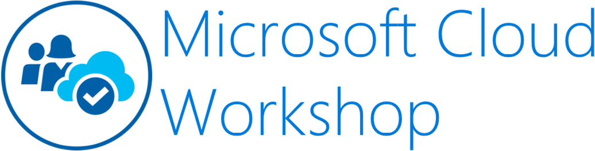
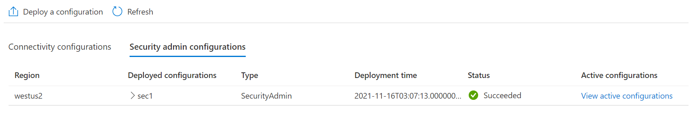
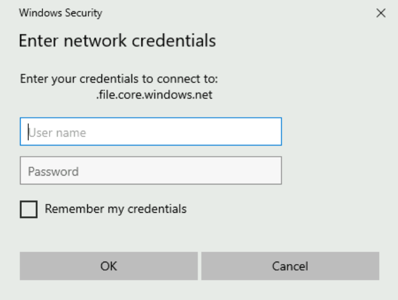
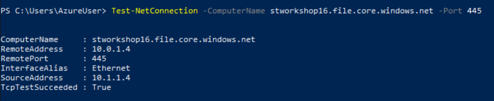
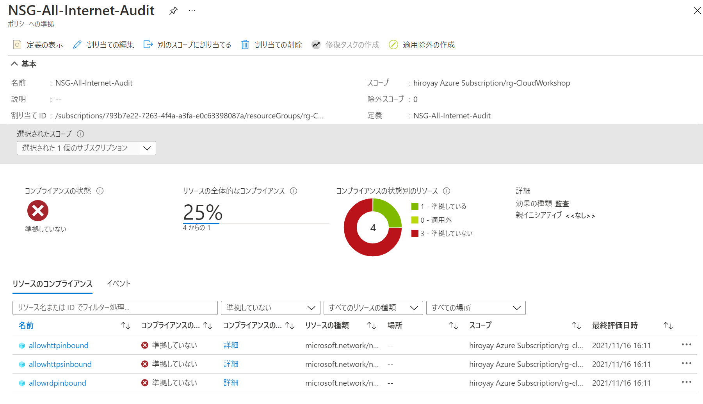

Network Hands-on lab  
December 2021

<br />

**Contents**
- [Exercise 1： セキュアな RDP/SSH 接続の構成](#exercise-1-セキュアな-rdp/ssh-接続の構成)

  - [Task 1： RDP による仮想マシンへの接続](#task-1-rdp-による仮想マシンへの接続)

  - [Task 2： Hub 仮想ネットワークの展開](#task-2-hub-仮想ネットワークの展開)

  - [Task 3： Virtual Network Manager の作成](#task-3-virtual-network-manager-の作成)

  - [Task 4：接続構成とセキュリティ管理規則の作成](#task-4-接続構成とセキュリティ管理規則の作成)

  - [Task 5： ネイティブ Windows クライアントを使用した仮想マシンへの接続](#task-5-ネイティブ-windows-クライアントを使用した仮想マシンへの接続)

- [Exercise 2： PaaS サービスへの安全な接続](#exercise-2-paas-サービスへの安全な接続)

  - [Task 1： ストレージ アカウントとファイル共有の作成](#task-1-ストレージ-アカウントとファイル共有の作成)

  - [Task 2： プライベート エンドポイントの作成](#task-2-プライベート-エンドポイントの作成)

  - [Task 3： プライベート エンドポイントへの NSG の適用](#task-3-プライベート-エンドポイントへの-NSG-の適用)


- [Exercise 3： Azure Policy によるネットワーク セキュリティ グループの評価](#exercise-3-azure-policy-によるネットワーク-セキュリティ-グループの評価)

  - [Task 1： ポリシー定義の作成](#task-1-ポリシー定義の作成)

  - [Task 2： ポリシー評価の実行](#task-2-ポリシー評価の実行)

- [Exercise 4： Azure Firewall による通信の制御](#exercise-4-azure-firewall-による通信の制御)

  - [Task 1： Azure Firewall Premium の展開](#task-1-azure-firewall-premium-の展開)

  - [Task 2： アウトバウンド ルートの構成](#task-2-アウトバウンド-ルートの構成)

  - [Task 3： ファイアウォール ポリシーの構成](#task-3-ファイアウォール-ポリシーの構成)

- [Exercise 5： Azure Monitor による監視](#exercise-5-azure-monitor-による監視)

<br />

### 前提条件

- Azure CLI 2.30 以降のバージョン

  [Azure CLI をインストール方法](https://docs.microsoft.com/ja-jp/cli/azure/install-azure-cli)

<br />

## Exercise 1： セキュアな RDP/SSH 接続の構成

### Task 1： RDP による仮想マシンへの接続

- ブラウザを起動し [Azure Portal](#https://portal.azure.com/) へアクセス

- リソース グループの仮想マシンを選択し、仮想マシンの管理ブレードへ移動

- **接続** メニューを表示

  **RDP** タブを選択し **RDP ファイルのダウロード** をクリック

  

- リモート デスクトップ接続のダイアログで **接続** をクリック

  

- 資格情報を入力

  

- リモート デスクトップ接続のダイアログで **はい** をクリック

  

- RDP でインターネット経由で仮想マシンに接続できることを確認

  

<br />

### Task 2： Hub 仮想ネットワークの展開

- Azure Portal のホーム画面で **リソースの作成** をクリック

- 検索ボックスに **Virtual Network** と入力し、表示された候補から **Virtual Network** を選択

  

- **作成** をクリック

  

- リソース グループを選択し、仮想ネットワークの名前を入力

  

- **IPv4 アドレス範囲** を確認

  

  ※IPv4 アドレス範囲を変更する場合は、サブネットを追加

  

- **セキュリティ** タブで Basition を有効化

  - **BastionHost**: **有効化**

  - **Basiton名**： 任意

    

    ※パブリック IP アドレスを新規作成

    

- 設定内容を確認し作成

<br />

### Task 3： Virtual Network Manager の作成

- サブスクリプション管理ブレードの **プレビュー** を選択

  

- 検索ボックスに **network** と入力

  フィルター処理された結果から **AllowAzureNetworkManager** を選択し **登録** をクリック

  

- **状態** が **登録済み** となることを確認

  

- Azure Portal のホーム画面で **リソースの作成** をクリック

- 検索ボックスに **Network Manager** と入力し、表示された候補から **Network Manager** を選択

  

- **作成** をクリック

  


- 必要な設定を行いリソースを作成

  - **リソース グループ**： ワークショップで使用するリソース グループを選択

  - **Name**； 任意

  - **Region**： リソースを作成する地域を選択（プレビュー機能は地域が限定されることがあるため注意）

  - **Scope**： 使用中のサブスクリプションを選択

  - **Features**： **すべて選択**（Connectivity, Security admin）

    

<br />

### Task 4： 接続構成とセキュリティ管理規則の作成と展開

ネットワーク グループの作成

- Network Manager の管理ブレードの **Settings** - **Network groups** を選択

- **＋ Add** をクリック

  

- **Name** に名前を入力

  

- **Dynamic membership** を設定

  - **Parameter**： **Resource Group Name**

  - **Operator**： **Equals**

  - **Condition**： リソース グループを選択

    

    ※Preview resources をクリックし、リソース グループ内の仮想ネットワークが表示されることを確認

    

- ネットワーク グループを作成（Static membership は設定しない）

<br />

接続性の構成

- **Configurations** メニューを選択

  **＋ Create a configuration** - **Connectivity configuration** をクリック

  

-  **接続性** の構成

  - **Name**： 任意

  - **Topology**： **Hub and spoke**

  - **Hub**： Bastion を展開した仮想ネットワークを選択

  - **Network group name**： 先の手順で作成したネットワーク グループを選択

    ※Use hub as a gateway のチェックを外す

    

- **Add** をクリックして構成を追加

<br />

セキュリティ管理規則の構成

- **Configurations** メニューを選択

  **＋ Create a configuration** - **Security admin configuration** をクリック

  

- 名前を入力し **Add a rule collection** をクリック

  

- 名前を入力し、**Target network groups** のリストから作成したネットワーク グループを選択

  **Add a rule** をクリック

  

- Bastion から RDP 接続を許可するルールを追加

  - **Name**： 任意

  - **Priority**： 100

  - **Action**： **Allow**

  - **Direction**： **Inbound**

  - **Protocol**： **TCP**

  - **Source type**： **IP address**

  - **Source IP addresses**： Bastion を展開したサブネットのアドレス範囲

  - **Source port**： *

  - **Destination type**： **IP address**

  - **Destination IP addresses**： 仮想マシンが展開された仮想ネットワークのアドレス範囲

  - **Destination Port**： **3389**

    

- RDP 接続を拒否するルールも作成して追加

  - **Name**： 任意

  - **Priority**： 200

  - **Action**： **Deny**

  - **Direction**： **Inbound**

  - **Protocol**： **TCP**

  - **Source type**： **IP address**

  - **Source IP addresses**： 空白

  - **Source port**： *

  - **Destination type**： **IP address**

  - **Destination IP addresses**： 空白

  - **Destination Port**： **3389**

    

- 作成したルールを確認し **Save** をクリック

  

- 再度 **Save** をクリックし、セキュリティ管理規則を追加

<br />

構成の展開（Azure Portal）

- **Deployments** を選択し **Deploy a configuration** をクリック

  

- 展開する構成を選択し **Deploy** をクリック

  - **Configuration type**： **Connectivity**

  - **Configuraitons**： 先の手順で作成した接続性の構成にチェック

  - **Target regions**： 仮想ネットワークが展開されている地域を選択

    

- 展開が開始

  

- **Status** に **Succeeded** が表示され、展開が終了したことを確認

  

- 同様の手順で **Configuration type** に **Security admin** を選択し、作成したセキュリティ管理規則を展開

  **Status** に **Succeeded** が表示され、展開が終了したことを確認

  

<br />

構成の展開（PowerShell）

- 接続性構成のリソース ID を取得

  ```
  Get-AzNetworkManagerConnectivityConfiguration -NetworkManagerName <newtork manager name> -ResourceGroupName <resource group name>
  ```

- セキュリティ管理規則のリソース ID を取得

  ```
  Get-AzNetworkManagerSecurityAdminConfiguration -NetworkManagerName <network manager name> -ResourceGroupName <resource group name>
  ```

  ※リソース ID はメモ帳等に貼り付けて後で利用

- 配列を作成し、接続性構成のリソース ID を追加

  ```
  [System.Collections.Generic.List[string]]$cIds = @()

  $cIds.Add("<connectivity configuration resource id>")
  ```

- 配列を作成し、セキュリティ管理規則のリソース ID を追加

  ```
  [System.Collections.Generic.List[string]]$sIds = @()

  $sIds.Add(<security admin configuration resource id>)
  ```

- 配列を作成し、ターゲットとなる地域名を追加

  ```
  [System.Collections.Generic.List[string]]$target = @()

  $target.Add("<target region")
  ```

  ※ターゲットが複数ある場合は、対象となる地域をすべて追加

- ハッシュ テーブルの作成

  ```
  $deployConnectivity = @{ Name = '<network manager>'; ResourceGroupName = '<resource group>'; ConfigurationId = $cIds; TargetLocation = $target; CommitType = 'Connectivity' }
  ```

- 展開

  ```
  Deploy-AzNetworkManagerCommit @deployConnectivity
  ```

- ハッシュ テーブルの作成

  ```
  $deploySecurity = @{ Name = '<network manager>'; ResourceGroupName = '<resource group>'; ConfigurationId = $sIds; TargetLocation = $target; CommitType = 'SecurityAdmin' }
  ```

- 展開

  ```
  Deploy-AzNetworkManagerCommit @deploySecurity
  ```

  ※Azure Portal の Deployment で **Status** に **Succeeded** が表示され、展開が終了したことを確認

確認操作
- 仮想ネットワークのピアリングが作成されていることを確認

  

- 仮想マシンのネットワークからネットワーク接続のルールが追加されていることを確認

  

- RDP 接続ができないことを確認

  

- Bastion からは正常に接続できることを確認

  

<br />

### Task 5： ネイティブ Windows クライアントを使用した仮想マシンへの接続

- リソース グループの一覧から Bastion を選択し、管理ブレードを表示

- **構成** を選択し、Standard へアップグレード

  - **レベル**： **Standard**

  - **ネイティブ クライアント サポート (プレビュー)**： チェック

  

  ※５分強でアップグレードが完了

- ローカル PC から Azure CLI でコマンドを実行

  ```
  az login
  ```

  ※ブラウザが起動するのでサインインを実行

  ```
   az network bastion rdp --name "<bastion name>" --resource-group "<resource group name>" --target-resource-id "<virtual machine resource id>"
  ```

  ※仮想マシンのリソース ID は、仮想マシンの管理ブレードの Properties より取得

- ネイティブ クライアントでの仮想マシンへの接続

  

<br />

## Exercise 2： PaaS サービスへの安全な接続

### Task 1： ストレージ アカウントとファイル共有の作成

- Azure Portal のホーム画面から **リソースの作成** をクリック

- ストレージ アカウントの **作成** をクリック

  

- **基本** タブで必要な情報の入力を行い、他のタブは既定の設定のまま、ストレージ アカウントを作成

  - **Resource Group**： リソース グループを選択

  - **ストレージ アカウント名**： 任意

  - **パフォーマンス**： Standard

  - **冗長性**： Locally-redundant storage (LRS)

    

- ストレージ アカウントの管理ブレードで **ファイル共有** を選択

  **＋ ファイル共有** をクリック

  

- 新しいファイル共有を作成

  - **名前**： 任意

  - **レベル**： トランザクションが最適化されました

    

- 指定した情報でファイル共有が作成

  

- **ネットワーク** を選択

  

  ※すべてのネットワークからの接続が許可されていることを確認

- ローカル PC のエクスプローラーを起動

- アドレス バーに作成したファイル共有へのパスを入力し Enter キーを押下

  ```
  \\<storage account name>.file.core.windows.net\<file share>
  ```

- ネットワーク資格情報の入力を求めるダイアログが表示、アカウント名、パスワードを入力し **OK** をクリック

  - アカウント名： localhost\<storage account name>

  - パスワード： ストレージ アカウント キー

  

  ※ストレージ アカウント名とキーはストレージ アカウントの管理ブレードの **アクセス キー** から取得

  

- インターネット経由でファイル共有へアクセスできることを確認

  

  ※ TCP 445（Outbound）ポートの開放が必要

<br />

### Task 2： プライベート エンドポイントの作成

- ストレージ アカウントの管理ブレードから **ネットワーク** を選択

  **＋ Private endpoint** をクリック

  

- **リソース グループ** を選択し、名前

  

- **対象サブリソース** で **file** を選択

  

- プライベート エンドポイントを作成する仮想ネットワークと DNS の設定

  - **Virtual network**： Bastion を展開した仮想ネットワークを選択

  - **Subnet**： プライベート エンドポイントを作成するサブネットを選択

  - **プライベート DNS ゾーンと統合する**： はい

  - **リソース グループ**： プライベート DNS ゾーンを作成するリソース グループを選択

    

- プライベート エンドポイントを作成

- リソース グループから作成したプライベート エンドポイントと共に作成されたプライベート DNS ゾーンを選択

  

仮想ネットワーク リンクの作成

- プライベート DNS ゾーンの管理ブレードが表示

  **仮想ネットワーク リンク** を選択し **＋ 追加** をクリック

  

- **リンク名** を入力し、**仮想ネットワーク** には仮想マシンが展開されている仮想ネットワークを選択

  

- **OK** をクリックし、仮想ネットワーク リンクを作成

  ※仮想マシンからプライベート DNS ゾーンを使用した名前解決を可能とする設定

ストレージ アカウントへのネットワーク アクセス許可の設定

- ストレージ アカウントの管理ブレードから **ネットワーク** を選択

  **選択されたネットワーク** を選択し、あとは既定のまま **保存** をクリック

  

  ※インターネットからファイル共有へのアクセスを遮断

接続の確認

- 仮想マシンへ Bastion を使用し接続

- エクスプローラーを起動

- **Map network drive** をクリック

  

- ファイル共有へのパスを入力し **Finish** をクリック

  - **Folder**： \\<storage account name>.file.core.windows.net


    

- ネットワーク資格情報の入力を求めるダイアログが表示、資格情報を入力し **OK** をクリック

  - **User name**: localhost\<storage account name>

  - **Password**： ストレージ アカウント キー

  - **Remember my credentials**： チェック

    

- ファイル共有へアクセスが行えることを確認

  

- ローカル PC のエクスプローラーからのアクセスも実行し、アクセスが拒否されることを確認

### Task 3： プライベート エンドポイントへの NSG の適用

- Azure Portal のホーム画面から **リソースの作成** をクリック

- 検索ボックスに **Network Security Group** と入力し、表示される候補より **Network Security Group** を選択

  

- **作成** をクリック

  

- 作成先となるリソース グループを選択、名前を入力し、ネットワーク セキュリティ グループを作成

  

- 展開完了後、**リソースへ移動** をクリック

  

- **受信セキュリティ規則** を選択し **＋ 追加** をクリック

  

- 必要な情報の設定を行い規則を作成

  - **ソース**： Any

  - **ソース ポート範囲**： *

  - **宛先**： Any

  - **宛先ポート範囲**： **445**

  - **プロトコル**： **TCP**

  - **アクション**： **拒否**

  - **優先度**： 100

  - **名前**： 任意

    

- 規則が追加

  

- **サブネット** を選択し、**＋ 関連付け** をクリック

  

- プライベート エンドポイントが展開されているサブネットを選択

  

- ネットワーク セキュリティ グループを選択したサブネットに関連付け

  

- Bastion で仮想マシンへ接続

- PowerShell を起動

- Test-Connection コマンドレットでポートの開閉を確認

  ```
  Test-NetConnection -ComputerName <storage account namae>.file.core.windows.net -Port 445
  ```

  

- **TcpTestSucceeded** が **True** の場合、Cloud Shell でプライベート エンドポイントへの NSG 適用を有効化

  プライベート エンドポイントを展開した仮想ネットワークの情報を取得

  ```
  $vnet = Get-AzVirtualNetwork -Name '<vnet name>' -ResourceGroupName '<resource group name>'
  ```

  PrivateEndpointNetworkPolicies プロパティの確認

  ```
  ($vnet | Select -ExpandProperty Subnets | Where-Object {$_.Name -eq '<subnet name>'})
  ```

  ※Disabled の場合、NSG 適用が無効

  PrivateEndpointNetworkPolicies を Enabled に設定

  ```
  ($vnet | Select -ExpandProperty Subnets | Where-Object {$_.Name -eq '<subnet name>'}).PrivateEndpointNetworkPolicies = "Enabled"
  ```

  変更した設定を適用
  ```
  $vnet | Set-AzVirtualNetwork
  ```

- Test-Connection コマンドレットでポートの開閉を確認

  

  ※ TcpTestSucceeded が False で返ることを確認

<br />

## Exercise 3： Azure Policy によるネットワーク セキュリティ グループの評価

### Task 1： ポリシー定義の作成

- Azure Portal のホーム画面から **その他のサービス** をクリック

- **管理 + ガバナンス** から **ポリシー** を選択

- **定義** を選択し **＋ ポリシー定義** をクリック

  

- **定義の場所**、**名前**、**カテゴリ** を設定

  - **定義の場所**： サブスクリプションを選択

  - **名前**： 任意

  - **カテゴリ**： **既存のものを使用** を選択し **Network** を選択

    

- ポリシー ルールを入力し **保存** をクリック

  ```
  {
    "mode": "All",
      "policyRule": {
        "if": {
          "allOf": [
            {
              "field": "type",
              "equals": "Microsoft.Network/networkSecurityGroups/securityRules"
            },
            {
              "field": "Microsoft.Network/networkSecurityGroups/securityRules/access",
              "equals": "Allow"
            },
            {
              "field": "Microsoft.Network/networkSecurityGroups/securityRules/direction",
              "equals": "Inbound"
            },
            {
              "field": "Microsoft.Network/networkSecurityGroups/securityRules/sourceAddressPrefix",
               "in": [
                    "*",
                    "Internet"
                ]
            }
          ]
        },
        "then": {
          "effect": "audit"
        }
      },
    "parameters": {
    }
  }
  ```

- **割り当て** をクリック

  

- **スコープ** の **...** をクリックし、リソース グループを指定

  

- **非準拠メッセージ** を入力し、割り当てを作成

  

### Task 2： ポリシー評価の実行

- コマンドで評価スキャンを実行

  - Azure CLI

    ```
    az policy state trigger-scan --resource-group "<resource grouop name>"
    ```

  - PowerShell

    ```
    Start-AzPolicyComplianceScan -ResourceGroupName '<resource group name>'
    ```

    ※ポリシーの割り当てから評価まで数分かかることがあるため、コマンドで評価を実行

- 評価の結果を確認

  

  ※インターネットから接続が許可されているルールを列挙

<br />

## Exercise 4： Azure Firewall による通信の制御

### Task 1： Azure Firewall Premium の展開

サブネットの追加

- リソース グループ内のリソースから Bastion を展開した仮想ネットワークを選択

- **サブネット** を選択し **＋ サブネット** をクリック

  

- 名前に **AzureFirewallSubnet** と入力し、任意のアドレス範囲を指定

  

- **保存** をクリックし、仮想ネットワークへサブネットを追加

  

Azure Firewall Premium の作成

- Azure Portal のホーム画面から **＋ リソースの作成** をクリック

- **セキュリティ** を選択し **ファイア ウォール** の **作成** をクリック

- 必要情報を入力し作成

  - **サブスクリプション**： サブスクリプションを選択

  - **リソース グループ**： リソースを格納するリソース グループを選択

  - **名前**： 任意

  - **地域**： 展開先の地域を選択

  - **可用性ゾーン**： なし

  - **Firewall tier**： **Premium**

  - **Firewall Policy**： 新規作成

  - **仮想ネットワークの選択**： **既存のものを使用**（AzureFirewallSubnet を作成した仮想ネットワークを選択）

  - **パブリック IP アドレス**： 新規作成

  - **強制トンネリング**： 無効

    

    ※Firewall Policy の作成

    

    ※パブリック IP アドレスの作成

    
  
  - 展開が完了したことを確認し **リソースへ移動** をクリック

- **診断設定** を選択し **診断設定の追加する** をクリック

  
  
- すべてのログを Log Analytics へ送信するよう設定

  

- **概要** を選択し Azure Firewall に割り当てられているプライベート IP アドレスをコピー

  ※コピーしたプライベート IP アドレスは後の手順でしようするためメモ帳などに貼り付け

<br />

### Task 2： アウトバウンド ルートの構成

- Azure Portal のホーム画面から **＋ リソースの作成** をクリック

- 検索ボックスに **Route Table** と入力し、表示される候補より **Route Table** を選択

  

- **作成** をクリック

  

- 必要情報を設定し、リソースを作成

  - **サブスクリプション**： 使用するサブスクリプションを選択

  - **リソース グループ**： リソースを格納するリソース グループを選択

  - **リージョン**： 適用する仮想ネットワークと同一リージョンを選択

  - **名前**： 任意

  - **ゲートウェイのルートを伝達する**： Yes

  

- 展開が完了したことを確認し **リソースへ移動** をクリック

- **ルート** を選択し **＋ 追加** をクリック

  

- 必要情報を設定し **OK** をクリック

  - **ルート名**： 任意

  - **アドレス プレフィックス**： **0.0.0.0/0**

  - **ネクスト ホップの種類**： **仮想アプライアンス**

  - **ネクスト ホップ アドレス**： Azure Firewall のプライベート IP アドレス

    

- **サブネット** を選択し **＋ 関連付け** をクリック

  

- 仮想マシンが展開されているサブネットを選択

  

<br />

### Task 3： ファイアウォール ポリシーの構成

Web サイトへのアクセス確認

- Bastion を使用して仮想マシンに接続

- ブラウザを起動して任意の Web サイトへアクセス

  

  ※アクセスが拒否されることを確認

アプリケーション規則（許可）の作成

- Azure Portal にてファイアウォール ポリシーの管理ブレードを表示

  **アプリケーション規則** を選択し **＋ 規則コレクションの追加** をクリック

  

- すべての Web サイトへのアクセスを許可するルールを追加した規則コレクションを作成

  - **名前**： 任意

  - **規則コレクションの種類**： アプリケーション

  - **優先度**： 1000

  - **規則コレクション アクション**： 許可

  - **規則コレクション グループ**： DefaultApplicationRuleCollectionGroup

  - **規則**：

    - **名前**： 任意

    - **ソースの種類**： IP アドレス

    - **ソース**： *

    - **プロトコル**： http, https

    - **TLS 検査**： オフ

    - **Destination Type**： FQDN

    - **ターゲット**： *

    

- 規則が追加されたことを確認

  

- Bastion で仮想マシンへ接続し、Web サイトへのアクセスを確認

  

TLS 検査の設定

※以下の操作は仮想マシンで行うとダウンロードした証明書のコピーの操作が不要となりスムーズに行っていただけます

- ファイアウォール ポリシーの管理ブレードで **TLS 検査** を選択

  **有効** を選択し、あとは既定の設定のまま **保存** をクリック

  

  ※Key Vault サービスと自己署名証明書、証明書を格納するコンテナが生成

- Key Vault の管理ブレードへ移動し **証明書** を選択

  TLS 検査の設定で生成された自己署名証明書をクリック

  

- 現在のバージョンの証明書をクリック

  

- **PRX/EPM 形式でダウンロード** をクリックし、証明書をダウンロード

  

  ※ダウンロードした証明書は任意の場所に保存

- ダウンロードした証明書をダブルクリックし、インストールを実行

  - **Store Location**： **Local Machine** を選択

    
  
  - **証明書ストア**： **信頼されたルート証明機関**

    
  
アプリケーション規則（拒否）の作成

- Azure Portal にてファイアウォール ポリシーの管理ブレードを表示

  **アプリケーション規則** を選択し **＋ 規則コレクションの追加** をクリック

- 特定 Web サイトへのアクセスを拒否するルールを追加した規則コレクションを作成

  - **名前**： 任意

  - **規則コレクションの種類**： アプリケーション

  - **優先度**： 100

  - **規則コレクション アクション**： **拒否**

  - **規則コレクション グループ**： DefaultApplicationRuleCollectionGroup

  - **規則**：

    URL フィルタリングによるルール

    - **名前**： 任意

    - **ソースの種類**： IP アドレス

    - **ソース**： *

    - **プロトコル**： http, https

    - **TLS 検査**： **オン**

    - **Destination Type**： **URL**

    - **ターゲット**： www.microsoft.com/ja-jp/store/*
  
    Web カテゴリによるルール

    - **名前**： 任意

    - **ソースの種類**： IP アドレス

    - **ソース**： *

    - **プロトコル**： http, https

    - **TLS 検査**： オフ

    - **Destination Type**： **Web カテゴリ**

    - **ターゲット**： **ソーシャル ネットワーキング**

    
  
- **追加** をクリックし、ルール２つを含む規則コレクションを作成

  

確認操作

- Bastion で仮想マシンへ接続

- Web ブラウザを起動し https://www.microsoft.com/ja-jp へアクセス

  

  ※正常にページが表示されることを確認

- アドレス バーの鍵アイコンをクリックし、サイトの証明書を確認

  

  ※発行元が Azure Firewall Manager CA の自己署名証明書が使用されていることを確認

- セール をクリックすると、アクセスがブロックされることを確認

  

- Facebook や Twitter へのアクセスもブロックされることを確認

  

<br />

## Exercise 5： Azure Monitor による監視

- Azure Portal のホーム画面で **Azure Monitor** をクリック

- **ログ** を選択し、クエリを実行

  ```
  AzureDiagnostics
  | where ResourceType == "AZUREFIREWALLS"
  | extend
       proto =      extract(@"^([A-Z]+) ",1,msg_s)
      ,src_host =   extract(@"request from ([\d\.]*)",1,msg_s)
      ,src_port =   extract(@"request from [\d\.]*:(\d+)",1,msg_s)
      ,dest_host =  extract(@" to ([-\w\.]+)(:|\. |\.$)",1,msg_s)
      ,dest_port =  extract(@" to [-\w\.]+:(\d+)",1,msg_s)
      ,action =     iif(
         msg_s has "was denied"
        ,"Deny"
        ,extract(@" Action: (\w+)",1,msg_s))
      ,rule_coll =  extract(@" Rule Collection: (\w+)",1,msg_s)
      ,rule =       coalesce(
         extract(@" Rule: (.*)",1,msg_s)
        ,extract("No rule matched",0,msg_s))
      ,reason =     extract(@" Reason: (.*)",1,msg_s)
  | project TimeGenerated,Category,proto,src_host,src_port,dest_host,dest_port,action,rule_coll,rule,reason,msg_s
  ```

  ※アプリケーション ルールによりアクセス拒否されたログが表示

- [Azure Monitor Workbook for Azure Firewall](https://github.com/Azure/Azure-Network-Security/tree/master/Azure%20Firewall/Workbook%20-%20Azure%20Firewall%20Monitor%20Workbook) へアクセス

- **Deploy to Azure** をクリックし、Azure ブックをサブスクリプションへ展開

  - **サブスクリプション**： 使用するサブスクリプションを選択

  - **リソース グループ**： リソースを格納するリソース グループを選択

  - **リージョン**： 地域を選択

  - **Workbook Display Name**： 任意

  - **Workbook Type**： workbook

  - **Diagnostics Workspace Name**： Log Analytics ワークスペース

  - **Diagnostics Workspace Subscription**： Log Analytics が展開されているサブスクリプションのサブスクリプション ID

  - **Diagnostics Workspace Resource Group**： Log Analytics の格納先のリソース グループ名

  - **Workbook Id**： GUID

  

  ※PowerShell による GUID の生成

  ```
  [Guid]::NewGuid()
  ```

- 展開完了後、リソースへアクセス

  

